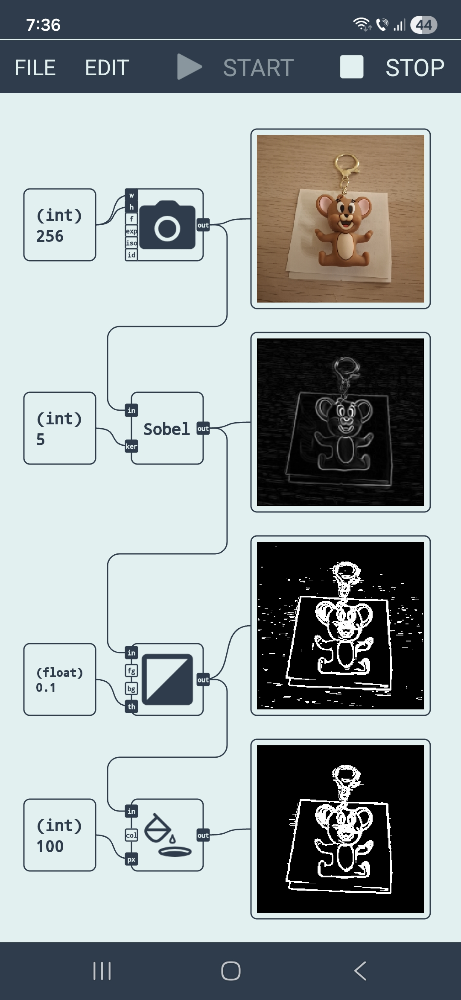

# Advanced Edge Detection Pipeline using [IoToToy](https://iototoy.com).

Real-time **Edge Detection and Morphological Filtering** workflow, converting a live camera stream into a cleaned binary mask.

## ⚙️ How it Works

The diagram connects 12 functional blocks to process video data through the following stages:

1.  **Input & Resizing**: Captures live video via the `camera` block, constrained to a **256x256** resolution for optimized performance.
2.  **Edge Detection**: Applies an `image_filter_sobel` (Kernel size: **5**) to highlight high-contrast boundaries.
3.  **Binarization**: Uses an `image_filter_binary` (Threshold: **0.1**) to separate edges from the background.
4.  **Refinement**: Employs an `image_filter_fill_holes` (Pixel limit: **100**) to remove noise and fill gaps in the detected shapes.
5.  **Monitoring**: Features four separate `display` nodes to visualize the transformation at every stage of the pipeline simultaneously.

## 🚀 Implementation

### Prerequisites
*   **IoToToy App**: Available on the [Google Play Store](https://play.google.com/store/apps/details?id=com.hardcodedjoy.iototoy&referrer=utm_source%3Dgh).
*   **Hardware**: Android-compatible device with a functional camera.

### Installation
1.  Install **IoToToy** on your Android device.
2.  Download the **JSON** file from this repository.
3.  Open IoToToy then **FILE -> OPEN** the JSON file.
4.  Run the diagram to see the real-time edge detection.

## 📊 Pipeline Specifications

| Component | Type | Configuration |
| :--- | :--- | :--- |
| **Source** | Camera | 256x256 px |
| **Filter 1** | Sobel | Kernel: 5 |
| **Filter 2** | Binary | Threshold: 0.1 |
| **Filter 3** | Fill Holes | Max Area: 100px |
| **Output** | Display | 4-Stage Monitoring |
